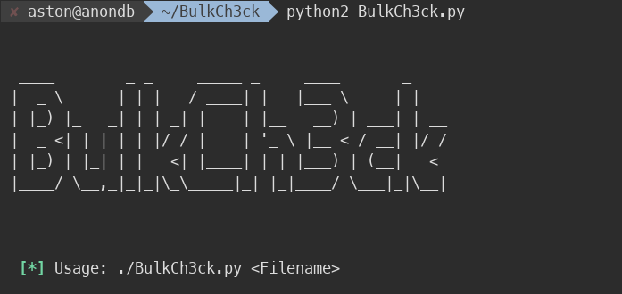
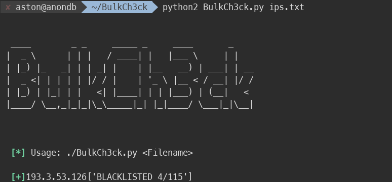

# BulkCh3ck
Basic IP reputation scanner based on IPVoid threat intel to get the work done by providing multiple IPs inside a file !    

## Installation

Use the package manager [pip](https://pip.pypa.io/en/stable/) to install all dependencies.

```bash
pip install -r requirements.txt
```

## Usage

```python
python2 BulkCh3ck.py <Filename>

Example:

python2 BulkCh3ck.py ips.txt
```



## Output:



## Additional Info:
Though i'm not using any API of IPVoid, the script is simply scraping the data from IPVoid website & thus it will restrict your IP address if you initate multiple requests in 1 hour !
